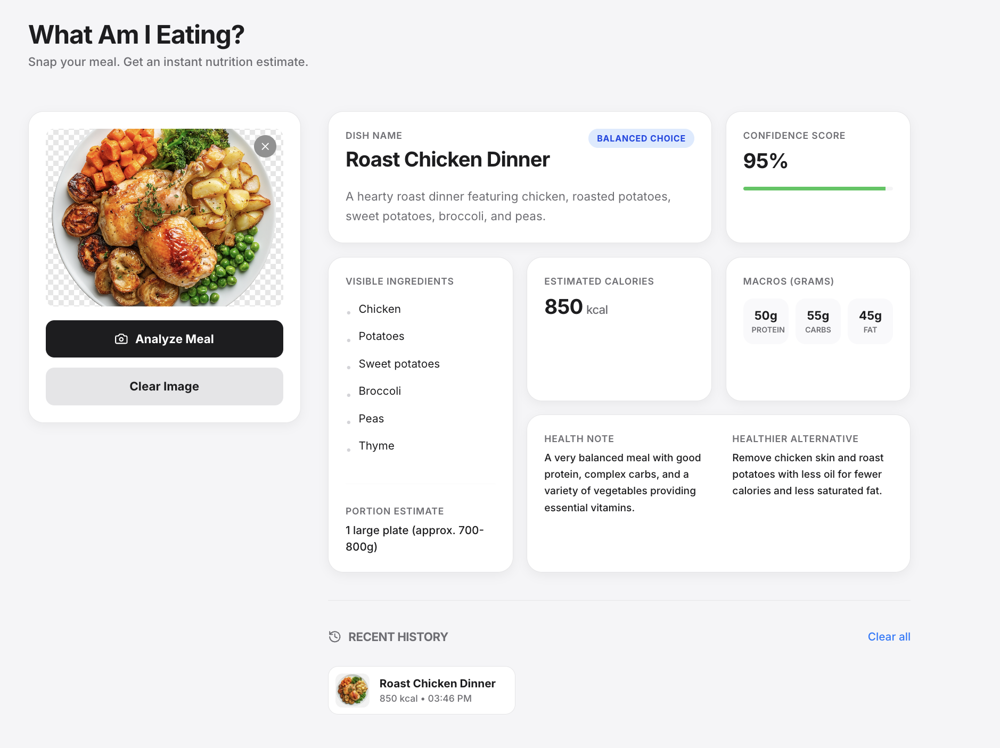

# What Am I Eating?

Upload a meal photo and get an instant nutrition estimate powered by Gemini.  
Check it out - [**Live**](https://sanjeev-ragunathan.github.io/mlh-ai-hackfest-04-2026/)



## Overview

**What Am I Eating?** is a hackathon MVP for fast meal understanding. A user uploads or drops in a food image, the app sends it to a server-side Gemini endpoint, and the UI returns a concise nutrition card with:

- Dish identification
- Visible ingredients
- Portion estimate
- Estimated calories
- Protein, carbs, and fat
- Confidence score
- Health note and healthier alternative
- Recent meal history stored in the browser

Nutrition values are AI estimates for informational use, not medical advice.

## Tech Stack

- React 19
- Vite 6
- Tailwind CSS 4
- Motion
- Lucide React
- Gemini API via `@google/genai`
- Vercel Serverless Functions
- `localStorage` for recent history

## How It Works

1. The user uploads a meal image in the browser.
2. The frontend posts the base64 image to `/api/analyze`.
3. The Vercel serverless function calls Gemini with a structured JSON schema.
4. The UI renders the estimated meal details and saves successful food analyses to local history.

The Gemini API key stays on the server and is not bundled into the client app.

## Local Setup

Prerequisites:

- Node.js 20+
- npm
- Gemini API key from Google AI Studio

Install dependencies:

```bash
npm install
```

Create a local environment file:

```bash
cp .env.example .env.local
```

Fill in `.env.local`:

```bash
GEMINI_API_KEY=your_gemini_api_key_here
GEMINI_MODEL=gemini-2.5-flash
```

Run the full app locally with the Vercel function:

```bash
npm run dev:vercel
```

Open:

```text
http://localhost:3000
```

For UI-only development without the serverless API:

```bash
npm run dev
```

## Scripts

```bash
npm run dev          # Vite frontend dev server
npm run dev:vercel   # Vercel dev server with /api/analyze
npm run lint         # TypeScript type check
npm run build        # Production build
npm run build:pages  # GitHub Pages build with the repo base path
npm run preview      # Preview the built app
npm run clean        # Remove dist
```

## Host on GitHub Pages

This repo includes a GitHub Actions workflow at `.github/workflows/pages.yml` that deploys the Vite frontend to GitHub Pages on every push to `main`.

Expected Pages URL:

```text
https://sanjeev-ragunathan.github.io/mlh-ai-hackfest-04-2026/
```

Important: GitHub Pages is static hosting. It cannot run the private Gemini API function in `api/analyze.ts`. For a fully working hosted app, set the repository variable `VITE_ANALYSIS_API_URL` to a deployed backend endpoint, or use the Vercel deployment below.

## Deploy to Vercel

Vercel is the fastest hosting path for this project because it can deploy the Vite frontend and `/api/analyze` serverless endpoint together.

1. Push this repo to GitHub.
2. Import the repo in Vercel.
3. Use the default Vite settings:
   - Framework preset: `Vite`
   - Build command: `npm run build`
   - Output directory: `dist`
4. Add environment variables in Vercel:
   - `GEMINI_API_KEY`
   - `GEMINI_MODEL` with `gemini-2.5-flash`
5. Deploy.

CLI deployment:

```bash
npx vercel
npx vercel env add GEMINI_API_KEY
npx vercel env add GEMINI_MODEL
npx vercel --prod
```

## Devpost Submission Checklist

- Project title: `What Am I Eating?`
- Short description: `Upload a meal photo and get instant AI-powered nutrition estimates.`
- Built with: `React`, `Vite`, `Tailwind CSS`, `Gemini API`, `Vercel`
- Demo link: the Vercel production URL
- Source code: this GitHub repository
- Screenshot: `images/app-screenshot.png`
- Notes: estimates are approximate and intended for quick nutrition awareness.

## Hackathon Context

Built for **MLH AI Hackfest, April 2026**.

- Event page: https://events.mlh.io/events/13503-ai-hackfest
- Devpost: https://ai-hackfest-29721.devpost.com/
